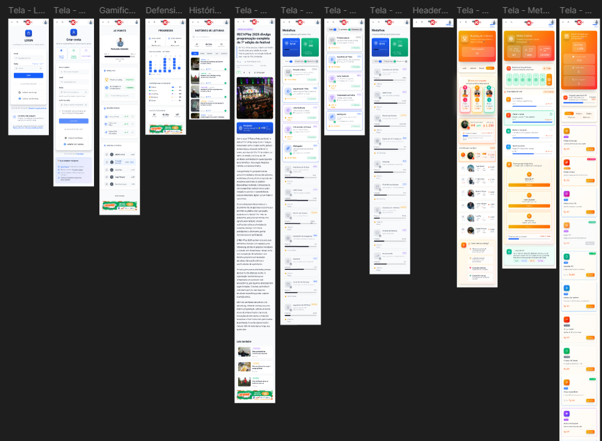
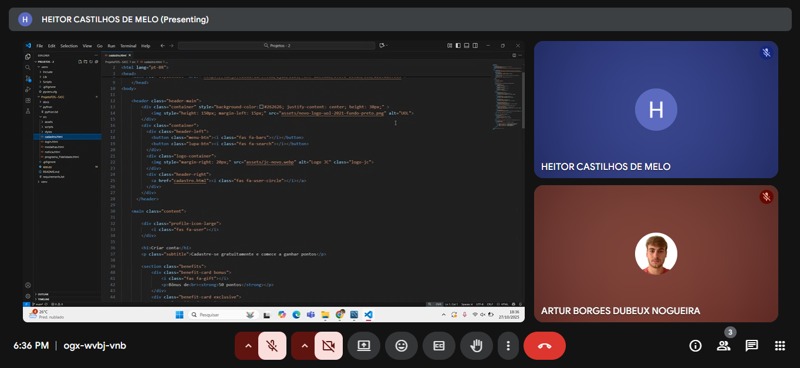
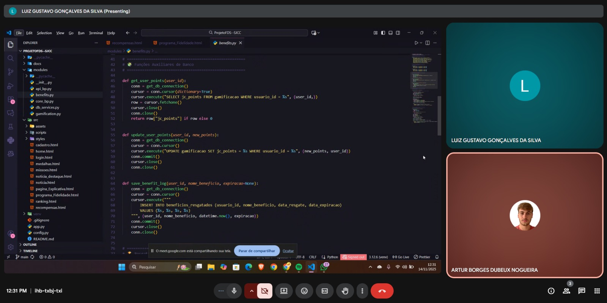

# Sistema Jornal do Commercio de Comunicação (SJCC) - CESAR School

---

## Contexto

O Sistema Jornal do Commercio de Comunicação (SJCC), um dos principais ecossistemas de mídia regional do Brasil, enfrenta desafios digitais relacionados à baixa taxa de segundo clique e permanência dos usuários na plataforma. Mudanças recentes nos algoritmos do Google, junto a novas formas rápidas e fragmentadas de consumo de conteúdo em múltiplas plataformas, impactaram negativamente a visibilidade e o tráfego orgânico do portal. Diante desses desafios, o SJCC buscou apoio da CESAR School para encontrar soluções eficazes.

## Problemas Identificados

- 📉 Baixa estrutura e interatividade das notícias.
- 🔍 Queda de tráfego orgânico e visibilidade em mecanismos de busca.
- 🚪 Dificuldade em gerar fidelização e estimular o “segundo clique”.
- ⚔️ Concorrência com veículos digitais mais ágeis.

## Objetivos

- 🔎 **Otimizar** conteúdos para mecanismos de busca (SEO).
- 🧭 **Incentivar** o segundo clique e aumentar a permanência do usuário.
- 🔗 **Unificar** os canais (jornal, rádio, TV e digital) em um só ecossistema.
- ❤️ **Fidelizar** a audiência com experiências contínuas e relevantes.

## Solução Proposta

Desenvolver uma plataforma digital integrada, centrada na experiência do usuário, que vai além de um simples repositório de notícias. O novo portal proporcionará jornadas contínuas e personalizadas, facilitando o consumo dinâmico e interativo das informações.

## Protótipo de Alta Fidelidade

## Tecnologias Utilizadas

* **Frontend:** HTML, CSS, JavaScript
* **Backend:** Python
* **Framework API:** Flask
* **Banco de Dados:** MySQL

## Programação em Par

Neste projeto, aplicamos a metodologia de Programação em Par (Pair Programming) para otimizar o desenvolvimento e garantir a qualidade do código.

Nossa abordagem foi a seguinte:

* *Dinâmica:* Utilizamos o formato clássico de *Piloto* (quem digita o código) e *Navegador* (quem revisa e guia a lógica).
* *Ferramentas:* As sessões foram conduzidas principalmente com VS Code e Google Meets para permitir a colaboração.
* *Aplicação:* Priorizamos o pareamento para implementar as histórias com um design alinhado, bem como uma integração do Front-End e o Back-End.
* *Rotatividade:* Os papéis eram trocados a cada 30 minutos para manter a dupla engajada e compartilhar o conhecimento tático e estratégico. 

Resultados e Benefícios:

A aplicação da Programação em Par proporcionou uma melhoria significativa na qualidade do código e na produtividade da equipe. A revisão constante entre os pares reduziu a ocorrência de bugs e promoveu um entendimento mais profundo das funcionalidades desenvolvidas. Além disso, a troca frequente de papéis incentivou o aprendizado mútuo e o desenvolvimento de habilidades complementares, fortalecendo a coesão do time.

 
Desafios e Aprendizados:

Durante o processo, enfrentamos desafios relacionados à conciliação de agendas e à adaptação inicial à dinâmica da metodologia. No entanto, com o passar do tempo, o time desenvolveu uma comunicação mais fluida e assertiva, tornando as sessões mais produtivas. Essa experiência reforçou a importância da colaboração ativa e da revisão contínua como práticas essenciais no desenvolvimento ágil.
 
Conclusão:

A adoção da Programação em Par demonstrou ser uma estratégia eficaz não apenas para aprimorar o código, mas também para promover o crescimento coletivo da equipe. O método contribuiu para um ambiente de trabalho mais colaborativo, transparente e orientado à qualidade.

## Impacto Esperado

* Aumento do tempo médio de permanência no portal.
* Maior relevância nos mecanismos de busca.
* Fortalecimento da autoridade digital do SJCC.
* Criação de uma experiência contínua de informação e conexão.

## Conclusão

O sucesso do reposicionamento digital do SJCC está na habilidade de transformar cada visita em uma experiência contínua, que incentiva a descoberta constante de novos conteúdos e fortalece o hábito de consumo no portal. Ao integrar jornalismo de qualidade, tecnologia avançada e uma experiência do usuário envolvente, o SJCC se reposiciona de forma estratégica e competitiva no ambiente digital, recuperando sua relevância e conquistando a fidelidade da audiência.

## Definição da Equipe

<table>
  <tr>
    <th>Nome</th>
    <th>Função</th>
    <th>LinkedIn</th>
    <th>Email</th>
  </tr>
  <tr>
    <td>Artur Leite</td>
    <td>Desenvolvedor Front-End</td>
    <td><a href="https://www.linkedin.com/in/arthurlcpessoa" target="_blank">LinkedIn</a></td>
    <td>alcp2@cesar.school</td>
  </tr>
  <tr>
    <td>Artur Borges</td>
    <td>Scrum Master</td>
    <td><a href="https://www.linkedin.com/in/arturborgesdnogueira" target="_blank">LinkedIn</a></td>
    <td>abdn@cesar.school</td>
  </tr>
  <tr>
    <td>Eduardo Augusto</td>
    <td>Desenvolvedor Back-End</td>
    <td><a href="https://www.linkedin.com/in/eduardo-augusto-47ab78369?" target="_blank">LinkedIn</a></td>
    <td>eapr@cesar.school</td>
  </tr>
  <tr>
    <td>Eduardo Henrique</td>
    <td>Desenvolvedor Front-End</td>
    <td><a href="https://www.linkedin.com/in/eduardo-palhares-627158316/" target="_blank">LinkedIn</a></td>
    <td>ehhp@cesar.school</td>
  </tr>
  <tr>
    <td>Heitor Castilhos</td>
    <td>Desenvolvedor Back-End</td>
    <td><a href="https://www.linkedin.com/in/heitor-castilhos-34179237b/" target="_blank">LinkedIn</a></td>
    <td>hcm2@cesar.school</td>
  </tr>
  <tr>
    <td>Luiz Gustavo</td>
    <td>Product Owner</td>
    <td><a href="https://www.linkedin.com/in/luiz-gustavo-878620192" target="_blank">LinkedIn</a></td>
    <td>lggs@cesar.school</td>
  </tr>
  <tr>
    <td>Matheus Arantes</td>
    <td>Cientista de Dados</td>
    <td><a href="https://www.linkedin.com/in/matheus-arantes-almeida-2a5a99366" target="_blank">LinkedIn</a></td>
    <td>maa2@cesar.school</td>
  </tr>
  <tr>
    <td>Roberto Figueiroa</td>
    <td>Desenvolvedor Back-End</td>
    <td><a href="https://www.linkedin.com/in/roberto-xavier-887121367" target="_blank">LinkedIn</a></td>
    <td>rfmxf@cesar.school</td>
  </tr>
</table>

