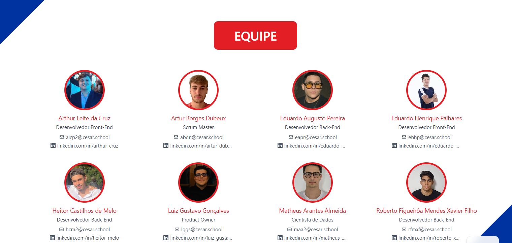

# Sistema Jornal do Commercio de Comunicação(SJCC) - CESAR School

---

## Contexto

O Sistema Jornal do Commercio de Comunicação (SJCC), um dos principais ecossistemas de mídia regional do Brasil, enfrenta desafios digitais relacionados à baixa taxa de segundo clique e permanência dos usuários na plataforma. Mudanças recentes nos algoritmos do Google, junto a novas formas rápidas e fragmentadas de consumo de conteúdo em múltiplas plataformas, impactaram negativamente a visibilidade e o tráfego orgânico do portal. Diante desses desafios, o SJCC buscou apoio da CESAR School para encontrar soluções eficazes.

## Problemas Identificados

- 📉 Baixa estrutura e interatividade das notícias.
- 🔍 Queda de tráfego orgânico e visibilidade em mecanismos de busca.
- 🚪 Dificuldade em gerar fidelização e estimular o “segundo clique”.
- ⚔️ Concorrência com veículos digitais mais ágeis.

## Objetivos

- 🔎 **Otimizar** conteúdos para mecanismos de busca (SEO).
- 🧭 **Incentivar** o segundo clique e aumentar a permanência do usuário.
- 🔗 **Unificar** os canais (jornal, rádio, TV e digital) em um só ecossistema.
- ❤️ **Fidelizar** a audiência com experiências contínuas e relevantes.

## Solução Proposta

Desenvolver uma plataforma digital integrada, centrada na experiência do usuário, que vai além de um simples repositório de notícias. O novo portal proporcionará jornadas contínuas e personalizadas, facilitando o consumo dinâmico e interativo das informações.

## Protótipo

## Impacto Esperado

* Aumento do tempo médio de permanência no portal.
* Maior relevância nos mecanismos de busca.
* Fortalecimento da autoridade digital do SJCC.
* Criação de uma experiência contínua de informação e conexão.

## Conclusão

O sucesso do reposicionamento digital do SJCC está na habilidade de transformar cada visita em uma experiência contínua, que incentiva a descoberta constante de novos conteúdos e fortalece o hábito de consumo no portal. Ao integrar jornalismo de qualidade, tecnologia avançada e uma experiência do usuário envolvente, o SJCC se reposiciona de forma estratégica e competitiva no ambiente digital, recuperando sua relevância e conquistando a fidelidade da audiência.

## Definição da Equipe 

